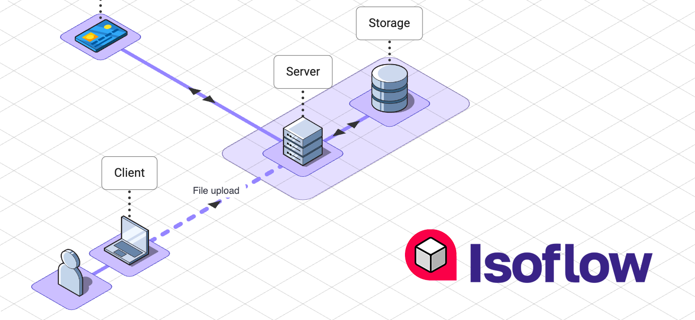

<div align="center">
    <h1>Cloudron Isoflow</h1>
    <p>A browser-based isometric editor for network and infrastructure diagrams, packaged as a Cloudron community app.</p>
</div>

<div align="center">

[](https://opensource.org/licenses/MIT)

</div>

## About this fork

This repository is a maintained fork of [markmanx/isoflow](https://github.com/markmanx/isoflow) by Mark Mankarious — the original MIT-licensed Community Edition. The upstream project has not seen updates in some time. We picked it up to:

- **Restore compatibility** with diagram JSON files exported by newer Isoflow forks (auto-migration of legacy `v2.3.0`-shaped models on import).
- **Package it for [Cloudron](https://cloudron.io)** as a community app with optional Cloudron single sign-on. See [`PUBLISHING.md`](./PUBLISHING.md) and [`packaging/cloudron/README.md`](./packaging/cloudron/README.md).
- Track all visible changes in [`CHANGELOG.md`](./CHANGELOG.md).

The original author retains copyright on the upstream Isoflow code (MIT, © 2025 Mark Mankarious); see [`LICENSE`](./LICENSE).

## Features

- **Drag-and-drop isometric editor** — icons, rectangles, connectors, text boxes.
- **1000+ built-in icons** — Isoflow's own set plus AWS, Azure, GCP, and Kubernetes packs, all bundled into the SPA at build time. No separate `@isoflow/isopacks` install needed at runtime.
- **JSON import / export** — diagrams travel as portable JSON files. Imports auto-migrate from the legacy `v2.3.0` schema if needed.
- **PNG export** of the current canvas.
- **Cloudron-native auth toggle** — public by default; flip `AUTH_ENABLED=true` in `/app/data/app.env` to gate the app behind Cloudron SSO for any authenticated user.

## Installing on a Cloudron

```bash
cloudron install --server my.example.com \
                 --versions-url https://raw.githubusercontent.com/pronetivity/cloudron-isoflow/main/CloudronVersions.json \
                 --location isoflow.example.com
```

Or in the Cloudron dashboard: **Settings → App Store → Add custom app** and paste the same `CloudronVersions.json` URL.

See [`PUBLISHING.md`](./PUBLISHING.md) for all install paths (`--versions-url`, `--image`, server-side build) and the release workflow.

## Local development

Install dependencies and start the dev server:

```bash
npm install
npm start
```

Build the standalone SPA bundle (the same one shipped inside the Cloudron image):

```bash
npm run docker:build       # outputs to ./dist
```

Run the test suite:

```bash
npm test
```

## Reporting bugs

Open an issue in this repository: [pronetivity/cloudron-isoflow/issues](https://github.com/pronetivity/cloudron-isoflow/issues).

## License

MIT.

- Upstream Isoflow © 2025 Mark Mankarious — see [`LICENSE`](./LICENSE) and the original repo at [markmanx/isoflow](https://github.com/markmanx/isoflow).
- Modifications and Cloudron packaging © 2026 ProNetivity Inc.
